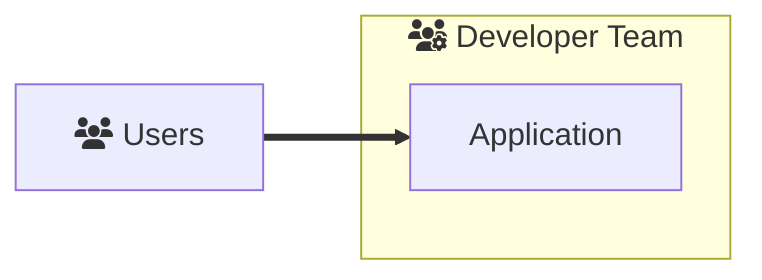
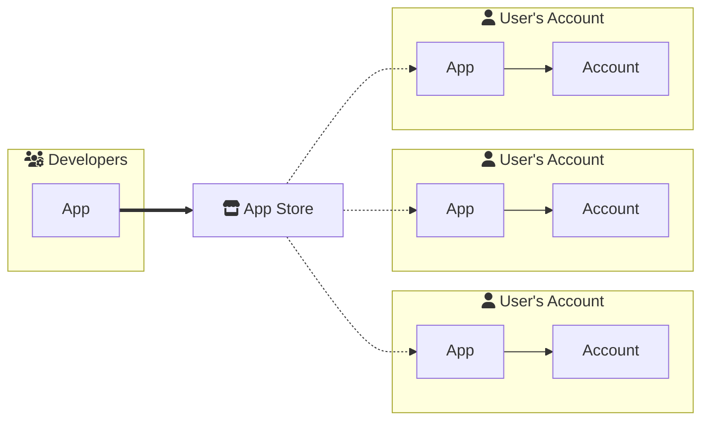

# Abstract SDK: A New Realm in Smart-Contract Development

If you're well-versed with smart-contracts, you'll find Abstract SDK as a more advanced, adaptable, and efficient tool. It brings you an extensive design space that transcends traditional smart-contract capabilities, introducing superior code reusability and an unmatched software distribution process.

## Advancing with Abstract SDK

Abstract SDK broadens your design space beyond traditional smart-contract development. Here, any application possible with stand-alone smart contracts can also be crafted using the SDK. However, we go a step beyond: the Abstract SDK promotes a level of code reusability unseen in the stand-alone smart-contract world. This functional perspective allows you to envision on-chain functionality and develop applications conceptually.

But the innovation doesn't stop here. With Abstract SDK, you code once, deploy it to any CosmWasm-supported blockchain, and watch other developers and users employ it in no time. The result? A revolutionary marketplace for smart-contracts where developers can vend their code to peers and users without permission constraints.

## Design Spaces Explained

### Traditional: Hosted Applications

Traditionally applications have been created by composing "stand-alone" smart contracts. Each smart-contract designed to fulfill a different role in the application's logic. We call these applications __hosted applications__ since they're deployed and controlled by the  code maintainers, and to use them, users transfer funds to the application's smart contract. Dexes, lending markets, yield aggregators are all examples of hosted applications.

### Innovative: Self-Hosted Applications

Self-hosted applications, on the other hand, represent a novel concept only achievable with the Abstract SDK. Here, __users own their applications__ and don't need to transfer funds to the application's smart contract. Instead, they deploy the smart contract to their account, which grants the application rights to access those funds. Each application is a new instantiation of a smart-contract that is owned and configurable by the user. The user can thus update the application's code, parameters, and permissions at any time, without relying on the application's maintainers.

This approach offers two significant benefits:

- __Sovereignty:__ Users have more control over their funds as they don't need to trust application maintainers.
- __Customizability:__ Users can tailor their application, leading to novel customization options unavailable with hosted applications.
